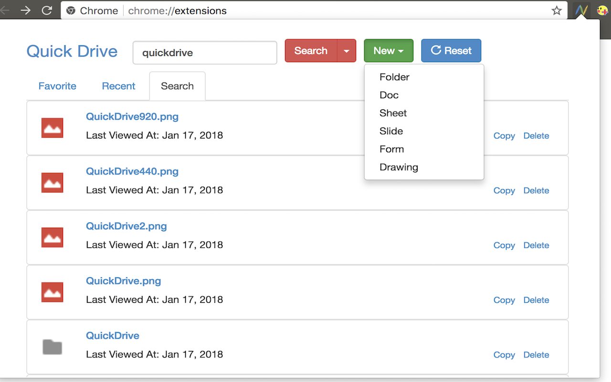

#  Quick Drive 2

Chrome extension to provide quick access to your Google Drive files. (version 2)



[Chrome Web Store](https://chrome.google.com/webstore/detail/quick-drive/aijfbconiilhjgfljolkoiaockgenpgn?utm_source=chrome-ntp-icon)


## Description

Quick Drive offers these functions.

- view stared items
- view recent items
- search items by keyword
- jump to each item pages
- link to top page of Google Drive


## Develop

### Environments

- yarn 0.16.1
- React / Redux
- gulp / webpack / babel

### gulp tasks

```Shell
# build for development
gulp build-dev

# build for release
gulp build

# compress to zip file
gulp zip

# continuous build by monitoring
gulp watch
```

### build for development

To build for development, make `dev_auth_key.json` file in
the project root. The file content is like below.

```JSON
{
   "key": "XXXXXXXXXXXXXXXXXXXXXXXXXXXXXXXXXXXXXXXXXXXX"
}
```


## Licence

[MIT](https://github.com/tearoom6/QuickDrive/blob/master/LICENSE)

## Author

[tearoom6](https://github.com/tearoom6)
